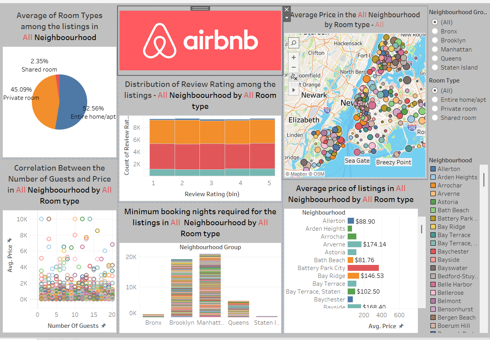

# Airbnb_Nyc
# 🏠 Airbnb NYC Data Cleaning & Analysis

This project focuses on cleaning and analyzing an **Airbnb New York City dataset** using **Power BI**.  
The goal was to transform a messy raw dataset into a clean, analysis-ready format and uncover insights into pricing, reviews, and host behavior.

---

## 📂 Dataset
- **Raw File** → `AB_NY_2019.csv`  
- **Clean File** → `Cleaned_AB_NY_2019.csv`  

The raw dataset contained inconsistencies:
- Mixed date formats (`10/19/2018` vs. `2019-06-22 00:00:00`)  
- Missing values in reviews and ratings  
- Non-numeric fields stored as text  
- Outliers in `price` and `minimum_nights`  

---

## 🧹 Data Cleaning Process (Power BI – Power Query)
1. **Standardized Column Names**  
   - Converted to lowercase & snake_case for consistency.  

2. **Fixed Data Types**  
   - Converted `last_review` to DateTime.  
   - Ensured numeric columns (`price`, `reviews_per_month`, `review_rating`, `number_of_guests`) had correct types.  

3. **Handled Nulls & Missing Values**  
   - Replaced missing `reviews_per_month` with `0`.  
   - Dropped duplicate rows and empty entries.  

4. **Outlier Detection**  
   - Flagged listings with `minimum_nights > 365` or extreme prices.  

5. **Created Clean Dataset**  
   - Exported final dataset as `airbnb_clean.csv`.  

---

## 📊 Key Findings
After cleaning and exploration, here are the highlights:

- **Room Types**  
  - Manhattan and Brooklyn dominate with high-priced `Entire home/apt` listings.  
  - Private rooms are more common in Harlem, Crown Heights, and South Slope.  

- **Pricing Patterns**  
  - Median Manhattan price ≈ **$200/night**, ~2× higher than Brooklyn (~$100/night).  
  - Neighborhoods like Chelsea & East Harlem are premium zones.  
  - Budget-friendly areas: Clinton Hill, Williamsburg, South Slope.  

- **Host Insights**  
  - Some “hosts” manage **300+ properties** → professional operators.  
  - Independent/single-property hosts often have better reviews.  

- **Review Trends**  
  - Properties with >100 reviews average **4.5+ rating**.  
  - Many inactive listings (availability = 0) or missing reviews → potential churn.  

---

## 🛠 Tools Used
- **Power BI (Power Query)** – cleaning, transformation, and modeling  
- **CSV / Excel** – dataset storage  

## 📷 Dashboard Preview

---

## 📁 Repository Structure
